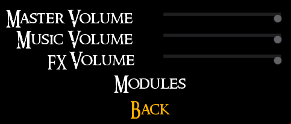

# GUI element: `button_container`

List of menu buttons, which includes the ability to add any UI object
as a component, and sub-menus.  The buttons are added at run-time,
so that items can be added or removed depending on the program state.



**Category**: `gui`


## Usage

If you are adding the menu directly into your scene, then start by adding a
`Container` object into your scene tree.  Then, at the bottom of the Inspector
properties for this new object, select the Script **Load** option, and choose
the `lib/button_container.gd` file.

You can select these different behaviors:
* `horizontal_buttons` - (boolean) `true` if the buttons should be aligned
	horizontally, or `false` (default) if the buttons should be aligned
	vertically.
* `back_button_text` - (string) the text to display for sub-menu "back" buttons.
	This will be translated.  Defaults to `MENU_BACK_BUTTON`.
* `separation` - (int) separation pixels between menu items (overrides the theme
	property in `HBoxContainer` or `VBoxContainer`)

Because the menu can grow large, you generally should enclose it inside a
`ScrollContainer`.

The container uses `Button`, `VBoxContainer` or `HBoxContainer` (depending on
the `horizontal_buttons` setting), and `CenterContainer` built-in objects,
so those parts will inherit the theme for this node.

The [2d example](../../examples/2d) shows a usage of this container.

### Adding Buttons

In your parent node's `_ready()` method (or at any other time it's required),
you invoke the `set_buttons()` method on the button container node.

The `set_buttons()` method takes an array of dictionaries.  Each dictionary
has a set of keys specific to the type of button.  For example,

```
var menu = get_node("menu/ButtonContainer")
menu.set_buttons([
	{ "name": "XL_NAME_1", "obj": self, "func": "_on_n1_pressed" },
	{ "name": "XL_MENU", "obj": self, "type": "menu", "func": "_on_menu_pressed" }
])
```


#### Normal Button

A normal button uses a dictionary with 3 keys:

* `name` - display name for the button, and the node name for the button.
	Will be translated.
* `func` - function name to invoke when the button is pressed.
* `obj` - the object that has the function

When the button is pressed, the object's function will be invoked.


#### Menu Buttons

A button that changes the menu to a sub-menu when pressed.  It has 4 keys:

* `type` - must be set to `"menu"`.
* `name` - display name for the button, and the node name for the button.
	Will be translated.
* `func` - function name to invoke when the button is pressed.  This will
	return an array of button dictionaries that will be used for the sub-menu
	listing.
* `obj` - the object that has the function

When the button is pressed, the object's function will be invoked.  The returned
value should be an array of button dictionaries (just like what you pass into
`set_buttons()`).  The button list will then be replaced with the new set of
buttons, and an additional "back" button will be added at the bottom of the
list.  You can have sub-menus inside of sub-menus.


#### Node Buttons

This allows non-button elements to be added into the menu, such as option
menu sliders (volume levels, video modes, etc.).  It has 2 required keys:

* `type` - must be set to `"node"`.
* `obj` - the node object to insert into the menu.

The node object should be wired up to signals before being added into the menu.

